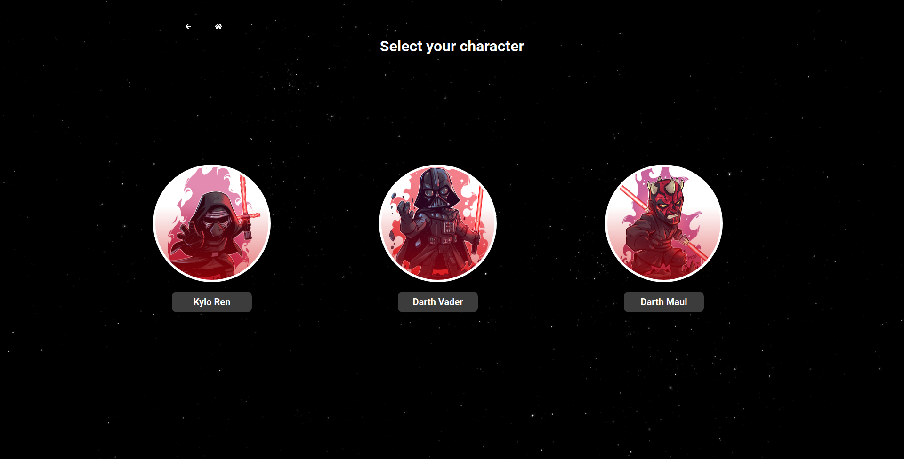

<span id="top"></span>

<p align="center">
  
</p>

<p align="center">
   <a href="https://starwarsbtlgame.netlify.app/"></a>
</p>

<p align="center">
  <a href="https://pt-br.reactjs.org/"></a>
  <a href="https://redux.js.org/"></a>
  <a href="https://github.com/reduxjs/redux-thunk"></a>
  <a href="https://reacttraining.com/react-router/web/guides/quick-start"></a>
  <a href="https://www.conventionalcommits.org/en/v1.0.0/"></a>
</p>

## 💡 Introduction

⚔️ A turn-based RPG concept game based on the Star Wars theme

## 🚀 Install

```sh
$ git clone https://github.com/gabriel-roque/starwars-battle
$ npm i && npm start
```

## 🖼️ Previews





## 👤 Authors

<p align="center">
  <a href="https://www.linkedin.com/in/gabriel-roque/">
    
  </a>
  <a href="https://github.com/gabriel-roque">
    
  </a>
</p>

## 🤝 Contributing

Contributions, issues and feature requests are welcome!<br />Feel free to check [issues page](https://github.com/gabriel-roque/starwars-battle/issues).

## Show your support

Give a ⭐️ if this project helped you!

[🔝 back to top](#top)

<p align="center">
  
</p>
